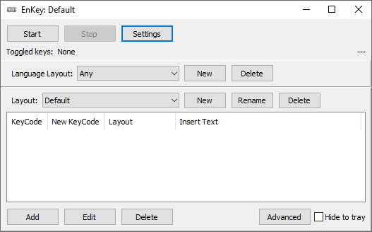
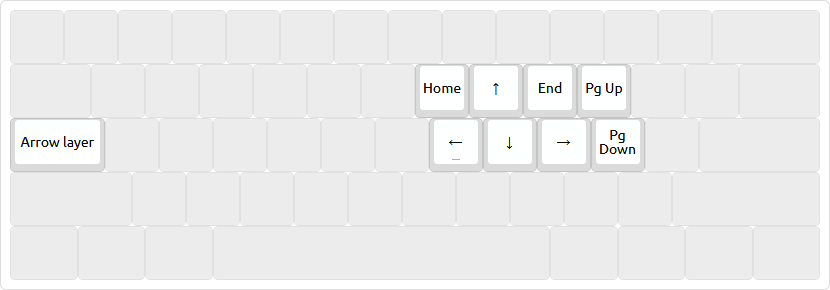
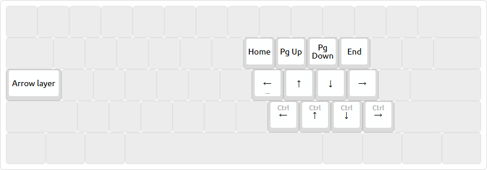

# Enhanced Keyboard - программа для улучшения раскладки клавиатуры

Это программа, которая отслеживает все ваши нажатия в реальном времени, и на основе них и той раскладки, которую вы настроете, посылает другие клавиши. Таким образом, можно поменять некоторые клавиши местами, создавить клавиши переключения слоя, установить макросы.



# Скачать

[`bin/EnhancedKeyboard.exe`](https://github.com/klavarog/enhanced-keyboard/raw/master/bin/EnhancedKeyboard.exe).

# Возможности

* При нажатии на любую клавишу можно сделать следующее действие:
	* **Нажатие другой клавиши** (ремаппинг).
		* Можно поставить модификатор Ctrl, Alt, Shift.
	* **Макрос** (`Text`), более подробно об этом написано ниже, либо в `src/sndkey32.pas`.
	* **Включение слоя.** Выключается слой следующим образом
		* Слой выключается после отпускания клавиши, по аналогии с Shift (`Key up`).
		* Слой выключится только если нажать эту клавишу ещё раз, по аналогии с Caps Lock (`Toggle`).
		* Слой применяется только к следующей нажатой клавише (`Next key`).
		* Слой применяется после отпускания клавиши ещё некоторое время (`Key up + Delay`).
		* Так же при включении слоя можно выставить чтобы зажался модификатор Ctrl, Alt, Shift или их комбинация.
* Можно создавать разные конфигурации для разных языков.
* Сворачивание в трей.
* Все настройки хранятся в конфигурационном файле, реестр не используется, права администратора не требуются.
	* Соответственно для комфортной работы за любым компьютером под Windows нужно просто иметь эту программу с собой на флешке.

# Синтаксис макроса

Это объяснение синтаксиса в поле `Text`, хоть оно и называется "Текст", на самом деле при помощи него можно вставлять не только обычный текст, но ещё и любые последовательности нажатий клавиш, иными словами - макросы.

Для начала, можно отправить просто текст, даже любой юникодный символ, написав `❶ababa ¯\_(ツ)_/¯`.

Для отправки специальных символов `+^%~{}()` надо их окружить в фигурные скобки, например `{+}{)}` отправит `+)`.

Имеются системные клавиши, которые можно послать, написав их имя в фигурных скобках:

```
BKSP, BS, BACKSPACE
CAPSLOCK, SCROLLLOCK
DEL, DELETE
ENTER, TAB
ESC, ESCAPE
F1, F2, F3, F4, F5, F6, F7, F8, F9, F10, F11, F12, F13, F14, F15, F16
LEFT, RIGHT, UP, DOWN, HOME, END, PGUP, PGDN
BREAK, CLEAR, NUMLOCK, INS, HELP
PRTSC
```

Можно задать повтор клавиши в фигурных скобках, например: `{left 5}` нажмет клавишу `Left` 5 раз.

Например после вызова `abc123{left}{left}{left}def{end}456{left 6}ghi{end}789` в итоге получится строка `abcdefghi123456789`.

Для задания модификаторов используются особые символы и круглые скобки. Список модификаторов:

```
Shift = +
Control = ^
Alt = %
```

К сожалению, программа не умеет использовать модификатор `Win`.

Для применения модификатора к множеству символов используются круглые скобки: `+(KC)` Отправит `Ctrl+K Ctrl+C`. Если же не написать круглые скобки, то модификатор применится только к следующему символу: `+KC` = `Ctrl+K C`.

# Пример использования

## Стрелки в домашней позиции

Так как Caps Lock - очень редко используемая клавиша, находящаяся в очень удобном месте, было решено сделать её клавишей переключения слоя. Теперь, когда вы будете нажимать на эту клавишу, никакого режима Caps Lock не будет включаться. Вы можете поменять клавишу переключения слоя в другое место, на своё усмотрение, данная клавиша приводится как пример.

Установка конфигурации: переименовать в `Settings.aidb` и поместить в папку с программой.

### Обычная конфигурация



[Скачать конфигурацию.](https://github.com/klavarog/enhanced-keyboard/raw/master/config/arrows1.aidb)

### Необычная конфигурация



Особенность этой конфигурации в том, что все стрелки находятся полностью на домашней позиции, что позволяет разместить выше, симметрично стрелкам, клавиши для более высокоуровнего передвижения, а ниже - клавиши с зажатым Ctrl, для передвижения по словам.

Это может быть похоже на vim'овское hjkl, но там надо двигать указательный влево для достижения стрелок, а здесь нет.

Оно стоит того, чтобы переучиться, [ergozorax](http://klavogonki.ru/u/#/517589/) печатает так.

[Скачать конфигурацию.](https://github.com/klavarog/enhanced-keyboard/raw/master/config/arrows2.aidb)

## По мелочам

* **Переключение раскладки одной клавишей.**
	* Если у вас раскладка переключается на `Shift+Alt`, то используйте макрос `%+`. Если переключается на `Ctrl+Shift`, то `^+`.
* **Отдельные клавиши для Ctrl+C, Ctrl+V, Ctrl+A, Ctrl+Z.**
* **Отдельный слой с типографическими символами.**
	* Можно сделать аналогично [раскладке Бирмана](https://ilyabirman.ru/projects/typography-layout/), только этот слой будет включаться не на AltGr, а на любую клавишу, что вы пожелаете, например, тот же самый Caps Lock.
* **Запятая с автоматическим пробелом.**

# Источник

К сожалению, кто автор этой программы, - неизвестно. Лицензия, под которой она распространяется - неизвестна. Google ничего не находит.

Пошло всё отсюда: [Копия статьи на хабре](http://www.itshop.ru/Rasshiryaem-funktsionalnost-klaviatury/l9i31089) или она же в [архиве](https://web.archive.org/web/20170904124608/http://www.itshop.ru/Rasshiryaem-funktsionalnost-klaviatury/l9i31089); [тема на форуме](http://sharaga.org/index.php?showtopic=3810), она же в [архиве](https://web.archive.org/save/http://sharaga.org/index.php?showtopic=3810).
